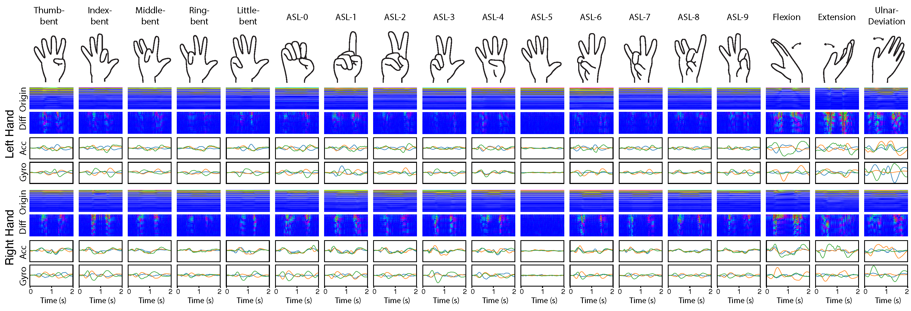

# GENERAL INFORMATION

**Project Name:**  
WatchHand Continuous Hand Pose Tracking Dataset


**Short Description:**  
A dataset (https://doi.org/10.7298/qf1v-j805) of C-FMCW-based active acoustic sensing and IMU data collected from off-the-shelf smartwatches for continuous 3D hand pose tracking.

___

# PROJECT OVERVIEW

**Full Description:**  
The WatchHand dataset supports research into continuous 3D hand pose tracking using commercial off-the-shelf (COTS) smartwatches. It leverages C-FMCW (Cross-Correlation-Based Frequency-Modulated Continuous Wave) active acoustic sensing to track 20 finger joints using built-in smartwatch sensors (speaker and microphone). The dataset also includes IMU data (accelerometer, gyroscope, and magnetometer) for potential future research, though it was not used in the final study results. This dataset is designed to facilitate the development and evaluation of machine learning models for hand pose estimation without requiring additional hardware beyond standard smartwatches.

The dataset includes data collected using three commercial smartwatches running WearOS:

- **Samsung Galaxy Watch 7**
- **Xiaomi Watch 2 Pro**
- **Google Pixel Watch 3**

All three smartwatches employ **C-FMCW active acoustic sensing** using their built-in speaker and microphone, transmitting inaudible frequency sweeps (18–21 kHz) and recording reflected signals at 48 kHz, 16-bit PCM. In addition, **IMU data** (accelerometer, gyroscope, and magnetometer) is captured and included for future research.

The dataset comprises data from **40 participants** across four studies:

- **Study 1 (Main Study):** 24 participants (12 males, mean age 22.5, SD 2.3)
- **Study 2 (Body Posture Study):** 6 re-invited participants from Study 1
- **Study 3 (Noise Condition Study):** 8 participants
- **Study 4 (Dynamic Hand Pose Study):** 8 participants

The dataset includes **18 distinct hand poses** organized into three categories:



- **Simple Gestures (5):**
  - Thumb-bent
  - Index-bent
  - Middle-bent
  - Ring-bent
  - Little-bent
- **Complex Gestures, American Sign Language (ASL) (10):**
  - ASL-0, ASL-1, ASL-2, ASL-3, ASL-4, ASL-5, ASL-6, ASL-7, ASL-8, ASL-9
- **Wrist Rotations (3):**
  - Flexion
  - Extension
  - Ulnar deviation

**Date of Creation:**  
March 2025 – December 2025

**Project Organization:**  
The dataset is organized into a directory structure with the following components:

- **Processed Data:** Derived echo profiles, IMU data, and synchronized video-based ground truth
- **Configuration Files:** `config.json` files containing synchronization metadata
- **Static Resources:** `hand_poses.png` and echo profile visualization images (`.png`)
- **Dependencies for Downstream Analysis:** Python, NumPy, PyTorch, MediaPipe, and related tools as needed

Please note that the machine learning code is not included in this project.

___
## Data Structure and File Naming Conventions

### Study 1 (Main Study)

**Folder naming format:** `sub{ID}_{watch}_{hand}_video`

- `{ID}`: Participant ID (e.g., `1`, `2`, `3`, ...)
- `{watch}`: Smartwatch model (`samsung`, `xiaomi`, `google`)
- `{hand}`: Watch-wearing hand (`left`, `right`)

**Example:** `sub1_samsung_left_video` — Participant 1, Samsung Galaxy Watch 7, worn on the left hand

```
Study1/
├── sub1_samsung_left_video/
│   ├── {PPPP}_{MMDD}_{HHMMSS}.csv
│   ├── config.json
│   ├── imu_config.json
│   ├── audio001_fmcw_16bit_profiles.npy
│   ├── audio001_fmcw_16bit_profiles.png
│   ├── audio001_fmcw_16bit_diff_profiles.npy
│   ├── audio001_fmcw_16bit_diff_profiles.png
│   ├── audio002_fmcw_16bit_profiles.npy
│   ├── ...
│   ├── audio010_fmcw_16bit_diff_profiles.png
│   ├── record_{YYYYMMDD}_{HHMMSS}_{microseconds}.mp4
│   ├── record_{YYYYMMDD}_{HHMMSS}_{microseconds}_frame_time.txt
│   ├── record_{YYYYMMDD}_{HHMMSS}_{microseconds}_records.txt
│   └── ...
├── sub1_samsung_right_video/
├── sub2_xiaomi_left_video/
├── sub2_xiaomi_right_video/
├── ...
└── sub24_google_right_video/
```

**Notes:**
- Each participant has 2 folders (left and right wearing hand)
- Each participant uses only 1 smartwatch model (Samsung, Xiaomi, or Google)
- Each folder contains 10 sessions of data (audio001–audio010)
- Study 1 includes 24 participants (sub1–sub24)

### Study 2 (Body Posture Study)

**Folder naming format:** `sub{ID}_{watch}_{hand}_{posture}_video`

- `{ID}`: Participant ID (e.g., `4`, `5`, `6`, `7`, `8`, `21` — returning participants from Study 1)
- `{watch}`: Smartwatch model (`samsung`, `xiaomi`, `google`)
- `{hand}`: Watch-wearing hand (`left`, `right`)
- `{posture}`: Body posture condition (`sit`, `arm_up`, `arm_down`)

**Example:** `sub4_samsung_left_arm_down_video` — Participant 4, Samsung Galaxy Watch 7, worn on the left hand, arm down posture

```
Study2/
├── sub4_samsung_left_arm_down_video/
│   ├── {PPPP}_{MMDD}_{HHMMSS}.csv
│   ├── config.json
│   ├── imu_config.json
│   ├── audio001_fmcw_16bit_profiles.npy
│   ├── audio001_fmcw_16bit_profiles.png
│   ├── audio001_fmcw_16bit_diff_profiles.npy
│   ├── audio001_fmcw_16bit_diff_profiles.png
│   ├── ...
│   ├── audio010_fmcw_16bit_diff_profiles.png
│   ├── record_{YYYYMMDD}_{HHMMSS}_{microseconds}.mp4
│   ├── record_{YYYYMMDD}_{HHMMSS}_{microseconds}_frame_time.txt
│   ├── record_{YYYYMMDD}_{HHMMSS}_{microseconds}_records.txt
│   └── ...
├── sub4_samsung_left_arm_up_video/
├── sub4_samsung_left_sit_video/
├── sub5_xiaomi_left_arm_down_video/
├── sub5_xiaomi_left_arm_up_video/
├── sub5_xiaomi_left_sit_video/
├── ...
└── sub21_{watch}_left_{posture}_video/
```

**Notes:**
- Participants are returning from Study 1: sub4, sub5, sub6, sub7, sub8, sub21
- Each participant has 3 folders (one for each body posture: sit, arm_up, arm_down)
- Session counts vary by posture:
  - `sit`: 2 sessions (audio001–audio002)
  - `arm_up`: 10 sessions (audio001–audio010)
  - `arm_down`: 10 sessions (audio001–audio010)
- Study 2 includes 6 participants

### Study 3 (Noise Condition Study)

**Folder naming format:** `sub{ID}_video`

- `{ID}`: Participant ID (e.g., `1`, `2`, `3`, ...)

**Example:** `sub1_video` — Participant 1

```
Study3/
├── sub1_video/
│   ├── audio001_fmcw_16bit_profiles.npy
│   ├── audio001_fmcw_16bit_profiles.png
│   ├── audio001_fmcw_16bit_diff_profiles.npy
│   ├── audio001_fmcw_16bit_diff_profiles.png
│   ├── ...
│   ├── audio014_fmcw_16bit_diff_profiles.png
│   ├── audio017_fmcw_16bit_profiles.npy
│   ├── ...
│   ├── audio020_fmcw_16bit_diff_profiles.png
│   ├── config.json
│   ├── record_{YYYYMMDD}_{HHMMSS}_{microseconds}.mp4
│   ├── record_{YYYYMMDD}_{HHMMSS}_{microseconds}_frame_time.txt
│   ├── record_{YYYYMMDD}_{HHMMSS}_{microseconds}_records.txt
│   └── ...
├── sub2_video/
├── ...
└── sub8_video/
```

**Session Conditions:**
- Sessions 1–10 (audio001–audio010): Baseline (no noise)
- Sessions 11–12 (audio011–audio012): Music
- Sessions 13–14 (audio013–audio014): Nearby Human Movement
- Sessions 15–16 (audio017–audio018): Walking
- Sessions 17–18 (audio019–audio020): Altered hand poses

**Notes:**
- Each participant has 1 folder
- Each folder contains 18 sessions (audio001–audio014, audio017–audio020)
- Study 3 includes 8 participants (sub1–sub8)
- Study 3 does not include IMU data
- Due to anonymization issues, Sessions 5, 6, 8, 11, 12, 13, and 14 of participant 5 (`sub5`) in Study 3 have been removed from the dataset

### Study 4 (Dynamic Hand Pose Study)

**Folder naming format:** `sub{ID}_raw/sub{ID}_{speed}`

- `{ID}`: Participant ID (e.g., `1`, `2`, `3`, `4`)
- `{speed}`: Hand pose variation speed (`normal`, `fast`, `slow`, `free`)

**Example:** `sub1_raw/sub1_normal` — Participant 1, normal speed hand pose variations

```
Study4/
├── sub1_raw/
│   ├── sub1_fast/
│   │   ├── {PPPP}_{MMDD}_{HHMMSS}.csv
│   │   ├── config.json
│   │   ├── audio001_fmcw_16bit_profiles.npy
│   │   ├── audio001_fmcw_16bit_profiles.png
│   │   ├── audio001_fmcw_16bit_diff_profiles.npy
│   │   ├── audio001_fmcw_16bit_diff_profiles.png
│   │   ├── record_{YYYYMMDD}_{HHMMSS}_{microseconds}.mp4
│   │   ├── record_{YYYYMMDD}_{HHMMSS}_{microseconds}_frame_time.txt
│   │   ├── record_{YYYYMMDD}_{HHMMSS}_{microseconds}_records.txt
│   │   └── ...
│   ├── sub1_free/
│   │   ├── {PPPP}_{MMDD}_{HHMMSS}.csv
│   │   ├── config.json
│   │   ├── audio001_fmcw_16bit_profiles.npy
│   │   ├── ...
│   │   └── ...
│   ├── sub1_normal/
│   │   ├── {PPPP}_{MMDD}_{HHMMSS}.csv
│   │   ├── config.json
│   │   ├── audio001_fmcw_16bit_profiles.npy
│   │   ├── ...
│   │   ├── audio020_fmcw_16bit_diff_profiles.png
│   │   └── ...
│   └── sub1_slow/
│       ├── {PPPP}_{MMDD}_{HHMMSS}.csv
│       ├── config.json
│       ├── audio001_fmcw_16bit_profiles.npy
│       ├── ...
│       └── ...
├── sub2_raw/
│   ├── sub2_fast/
│   ├── sub2_free/
│   ├── sub2_normal/
│   └── sub2_slow/
├── sub3_raw/
├── sub4_raw/
├── ...
└── sub8_raw/
```

**Speed Conditions:**
- `normal`: Standard speed hand pose transitions (20 sessions: audio001–audio020)
- `fast`: Fast speed hand pose transitions (1 session: audio001)
- `slow`: Slow speed hand pose transitions (1 session: audio001)
- `free`: Free-form hand pose transitions (1 session: audio001)

**Notes:**
- Each participant has 1 main folder (`sub{ID}_raw`) containing 4 speed subfolders
- Study 4 includes 8 participants (sub1–sub8)

### Common File Types Across All Studies

The following file types are common across all studies (with minor variations):

| File Type | Format | Description |
|-----------|--------|-------------|
| **Original Echo Profiles** | `audio{SSS}_fmcw_16bit_profiles.npy` | Precomputed original echo profiles for session `{SSS}` (NumPy array) |
| **Original Echo Profile Visualization** | `audio{SSS}_fmcw_16bit_profiles.png` | Visualization of the original echo profile |
| **Differential Echo Profiles** | `audio{SSS}_fmcw_16bit_diff_profiles.npy` | Precomputed differential echo profiles for session `{SSS}` (NumPy array) |
| **Differential Echo Profile Visualization** | `audio{SSS}_fmcw_16bit_diff_profiles.png` | Visualization of the differential echo profile |
| **Ground Truth Video** | `record_{YYYYMMDD}_{HHMMSS}_{microseconds}.mp4` | Video capturing the hand during the study, used for generating ground truth (MediaPipe was used in the original paper) |
| **Frame Timestamps** | `record_{YYYYMMDD}_{HHMMSS}_{microseconds}_frame_time.txt` | Timestamp of each ground truth video frame |
| **Gesture Timestamps** | `record_{YYYYMMDD}_{HHMMSS}_{microseconds}_records.txt` | Timestamp of each gesture performed |
| **Session Configuration** | `config.json` | Session configuration including audio-ground truth synchronization parameters |
| **IMU Configuration** | `imu_config.json` | IMU sensor configuration metadata (Studies 1, 2, 4 only) |
| **IMU Data** | `{PPPP}_{MMDD}_{HHMMSS}.csv` | Accelerometer, gyroscope, and magnetometer readings (Studies 1, 2, 4 only) |

Where:
- `{SSS}` = session number (e.g., `001`, `002`, `003`, ...)
- `{YYYYMMDD}` = recording date
- `{HHMMSS}` = recording time
- `{microseconds}` = timestamp microseconds
- `{PPPP}` = participant number (e.g., `0000`, `0001`, ...)

**Project Size:**  
- Study 1: 93.58 GB
- Study 2: 22.65 GB
- Study 3: 28.82 GB
- Study 4: 29.60 GB
- **Total: approximately 175 GB**

___
# INSTALLATION

**Step-by-Step Instructions:**  
This repository primarily provides documentation and structured dataset files. If users wish to access the dataset repository locally:

1. Download the files from Cornell University Library eCommons Repository
2. Navigate the directory structure using the naming conventions described above.
3. Load `.npy`, `.csv`, `.json`, `.txt`, and `.mp4` files using an IDE (e.g., VSCode) or a computing environment that will load these files.
4. For each session, load the corresponding `audio{SSS}_fmcw_16bit_profiles.npy` (original echo profile), `audio{SSS}_fmcw_16bit_diff_profiles.npy` (differential echo profile), and the matching `record_*****_frame_time.txt` and `record_*****.mp4` files for ground truth alignment using `config.json` and the synchronization formula provided in the Usage section.

**System Requirements:**  
Potential requirements for data analysis workflows include:

- A modern operating system (Linux, macOS, or Windows)
- Sufficient storage for the full dataset
- A Python environment for loading `.npy`, `.csv`, and `.json` files
- Optional GPU support for model training and evaluation

**Required Libraries, Packages, Modules:**  
The dataset README references the following tools or frameworks in the associated research workflow:

- **NumPy** (for `.npy` files)
- **PyTorch** (for model implementation)
- **MediaPipe** (for 3D hand pose annotation)
- Standard Python libraries for handling `.json`, `.csv`, and `.txt` files

**Setup Requirements:**  
Potential setup requirements for data use or model replication may include:

- Configuration of file paths to dataset directories
- Reading synchronization metadata from `config.json`
- Setting up analysis scripts to align audio and video timestamps
- Installing required Python packages for visualization, preprocessing, and model training

**Known Issues:**  
- No raw audio files are provided in the dataset; only the processed echo profiles and differential echo profiles are included.
- Due to anonymization issues, **Sessions 5, 6, 8, 11, 12, 13, and 14 of participant 5 (`sub5`) in Study 3** have been removed from the dataset.
- This project does not contain the machine learning code to support full model reproduction

___
# USAGE

**Step-by-Step Instructions:**  
After downloading the dataset, use the file organization and naming conventions described above to locate and load the relevant data files for analysis.

## Audio-Ground Truth Synchronization

The `config.json` file contains synchronization information to align echo profiles with ground truth video frames. Use the following formula to compute the corresponding echo profile index for a given ground truth timestamp:

```python
echo_profile_idx = round(
    ((timestamp - gt_syncing_timestamp) * sampling_rate + audio_syncing_idx)
    / frame_length
)
```

## Minimal Loading Example

The following Python code demonstrates how to load the echo profiles, configuration, and synchronize with ground truth:

```python
import json
import numpy as np

# =============================================================================
# 1. Load configuration
# =============================================================================
config_path = "path/to/sub1_samsung_left_video/config.json"
with open(config_path, 'r') as f:
    config = json.load(f)

# Audio configuration parameters
audio_config = config['audio']['config']
sampling_rate = audio_config['sampling_rate']      # 48000 Hz
frame_length = audio_config['frame_length']        # 600 samples per frame

# =============================================================================
# 2. Load echo profiles for a specific session
# =============================================================================
session_idx = 0  # Session index (0 for audio001, 1 for audio002, etc.)
data_folder = "path/to/sub1_samsung_left_video/"

# Get filename from config (or construct it directly)
# config['audio']['files'][session_idx] gives e.g., "audio001_fmcw_16bit_profiles.npy"
original_filename = config['audio']['files'][session_idx]
diff_filename = original_filename.replace('_profiles.npy', '_diff_profiles.npy')

# Load original echo profile
# Shape: (num_distance_bins, num_frames) where num_distance_bins=600
original_profile = np.load(f"{data_folder}{original_filename}")
print(f"Original echo profile shape: {original_profile.shape}")

# Load differential echo profile
# Shape: (num_distance_bins, num_frames)
diff_profile = np.load(f"{data_folder}{diff_filename}")
print(f"Differential echo profile shape: {diff_profile.shape}")

# =============================================================================
# 3. Synchronize echo profiles with ground truth
# =============================================================================
# Get synchronization parameters for this session
audio_syncing_idx = config['audio']['syncing_poses'][session_idx]
gt_syncing_timestamp = config['ground_truth']['syncing_poses'][session_idx]

def gt_timestamp_to_profile_idx(timestamp):
    """Convert ground truth timestamp to echo profile frame index."""
    return round(
        ((timestamp - gt_syncing_timestamp) * sampling_rate + audio_syncing_idx)
        / frame_length
    )

# =============================================================================
# 4. Load ground truth timestamps
# =============================================================================
# Get ground truth filename from config
gt_records_file = config['ground_truth']['files'][session_idx]
frame_time_file = gt_records_file.replace('_records.txt', '_frame_time.txt')

# Load frame timestamps (each line is a timestamp for one video frame)
with open(f"{data_folder}{frame_time_file}", 'r') as f:
    frame_timestamps = [float(line.strip()) for line in f.readlines()]

# Example: Get echo profile index for the 100th video frame
video_frame_idx = 100
timestamp = frame_timestamps[video_frame_idx]
echo_idx = gt_timestamp_to_profile_idx(timestamp)
print(f"Video frame {video_frame_idx} -> echo profile index {echo_idx}")
```

### Config.json Structure

The `config.json` file contains the following key fields:

```
config.json
├── audio
│   ├── config
│   │   ├── sampling_rate      # 48000 Hz
│   │   ├── frame_length       # 600 samples per frame
│   │   ├── bandpass_range     # [[18000, 21000]] Hz (FMCW frequency range)
│   │   └── ...
│   ├── files                  # List of echo profile filenames per session
│   │   └── ["audio001_fmcw_16bit_profiles.npy", "audio002_...", ...]
│   └── syncing_poses          # Audio sync sample index per session
│       └── [347, 270, 268, ...]
├── ground_truth
│   ├── files                  # List of ground truth record filenames
│   │   └── ["record_YYYYMMDD_HHMMSS_records.txt", ...]
│   ├── videos                 # List of ground truth video filenames
│   │   └── ["record_YYYYMMDD_HHMMSS.mp4", ...]
│   └── syncing_poses          # Ground truth sync timestamp per session
│       └── [54, 33, 31, ...]
└── sessions                   # Session timing information
    └── [[{start, duration}, ...], ...]
```

**Notes:**
- Echo profile dimensions: `(600, num_frames)` where 600 corresponds to the distance axis (each pixel ≈ 3.57 mm)
- The `syncing_poses` arrays align audio and ground truth data for each session
- Session indices are 0-based (session 0 = audio001, session 1 = audio002, etc.)

## Usage Examples

Example use cases include:

1. Replicate the paper for continuous hand pose tracking on COTS smartwatches using echo profiles
2. Replicate the paper for continuous hand pose tracking on COTS smartwatches using echo profiles and IMU data
3. Evaluate cross-session, cross-device, or cross-user generalization for hand pose tracking
4. Develop and benchmark novel deep learning architectures for acoustic-based hand pose estimation
5. Investigate multimodal sensor fusion techniques combining acoustic sensing with IMU data
6. Study the effects of environmental noise conditions on acoustic sensing performance

## Screenshots / Figures
- `hand_poses.png`
- Echo profile visualization images (`audio{SSS}_fmcw_16bit_profiles.png`)
- Differential echo profile visualization images (`audio{SSS}_fmcw_16bit_diff_profiles.png`)

**Known Limitations:**  
- IMU data is included for potential future use but was **not used in the final study results**.
- Explicit end-to-end reproduction instructions for the associated model are not included in the README.
- Some sessions from one participant in Study 3 were removed due to anonymization issues.
- Additional limitations may apply to cross-device, cross-user, or dynamic gesture generalization.

___
# LICENSE

**Licenses/Restrictions Placed on the Data:**
CC BY license (Creative Commons Attribution 4.0 International License). The CC BY license allows for maximum dissemination and re-use of open access materials and is preferred by many research funding bodies. Under this license users are free to share (copy, distribute and transmit) and remix (adapt) the contribution including for commercial purposes, providing they 
attribute the contribution in the manner specified by the author or licensor 
(http://creativecommons.org/licenses/by/4.0/legalcode).

**Preferred Citation:**  
Jiwan Kim, Chi-Jung Lee, Hohurn Jung, Tianhong Yu, Ruidong Zhang, Ian Oakley, Cheng Zhang. (2026) Data from: WatchHand: Enabling Continuous Hand Pose Tracking On Off-the-Shelf Smartwatches [Data set] Cornell University Library eCommons Repository. https://doi.org/10.7298/qf1v-j805

___
# CONTACT INFORMATION

**Primary Contact**
Name: Chi-Jung Lee
Role: First Author
Institution: Cornell University, USA  
ORCID: 0000-0002-1887-4000  
Email: cl2358@cornell.edu

**Secondary Contact**
Name: Cheng Zhang  
Role: Principal investigator  
ORCID: 0000-0002-5079-5927  
Institution: Cornell University, USA  
Email: chengzhang@cornell.edu  

**Additional Contributors**
Name: Jiwan Kim  
ORCID: 0000-0002-0806-2797  
Institution: Korea Advanced Institute of Science & Technology (KAIST), Republic of Korea  
Email: jiwankim@kaist.ac.kr  

Name: Hohurn Jung  
Institution: Korea Advanced Institute of Science & Technology (KAIST), Republic of Korea  
ORCID: 0009-0008-8096-1050  
Email: cllocker@kaist.ac.kr

Name: Tianhong Catherine Yu
Institution: Cornell University, USA
ORCID: 0000-0002-3742-0178  
Email: ty274@cornell.edu

Name: Ruidong Zhang  
Institution: Cornell University, USA  
ORCID: 0000-0001-8329-0522  
Email: rz379@cornell.edu

Name: Ian Oakley
Institution: Korea Advanced Institute of Science & Technology (KAIST), Republic of Korea  
ORCID: 0000-0001-5834-8577  
Email: ian.r.oakley@gmail.com

___
# ACKNOWLEDGEMENTS

**Funding:**  
This work was supported by the National Science Foundation under Grant No. 2239569 (NSF CAREER Award) and the IITP (Institute of Information & Communications Technology Planning & Evaluation) ITRC (Information Technology Research Center) grant funded by the Korea government (Ministry of Science and ICT) (IITP-2026-RS-2024-00436398).

**Publications Using Our Software:**  

Conference Paper Citation:
```bibtex
@inproceedings{kim2026watchhand,
  author = {Kim, Jiwan and Lee, Chi-Jung and Jung, Hohurn and Yu, Tianhong Catherine and Zhang, Ruidong and Oakley, Ian and Zhang, Cheng},
  title = {WatchHand: Enabling Continuous Hand Pose Tracking On Off-the-Shelf Smartwatches},
  year = {2026},
  isbn = {979-8-4007-2278-3/2026/04},
  publisher = {Association for Computing Machinery},
  address = {New York, NY, USA},
  url = {https://doi.org/10.1145/3772318.3790932},
  doi = {10.1145/3772318.3790932},
  booktitle = {Proceedings of the 2026 CHI Conference on Human Factors in Computing Systems},
  location = {Barcelona, Spain},
  series = {CHI '26}
}
```
